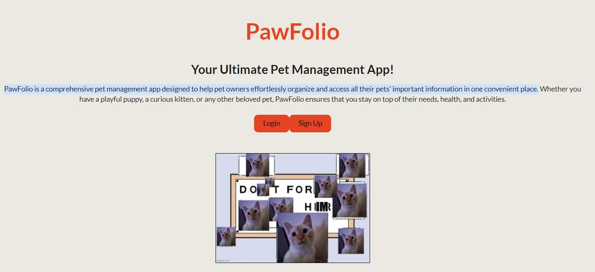
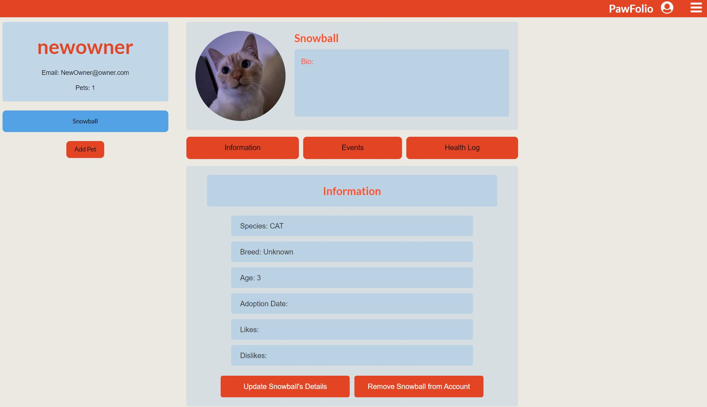

# Project Title
PawFolio

 

## Description 🔎
PawFolio is a comprehensive pet management app designed to help pet owners effortlessly organize and access all their pets' important information in one convenient place.

## Table of Contents 📖
- [Deployed Application](#Deployed-application-🚀)
- [License](#license-MIT)
- [ScreenShots](#Screenshots)
- [Contibuters](#Contributors-🧑‍🤝‍🧑)

## Deployed-Application
https://pawfolio-4kk9.onrender.com/

## ScreenShots

## License
      This application is covered by the MIT license.

## Contributors 🧑‍🤝‍🧑
Ryan Moise, Chelsea Ramdat, Jackie Gould, and Ben Montijo

## Questions 🙋
If there are any questions, feel free to email us at:  ryan.a.moises@gmail.com, Cbramdat@gmail.com, and mojo718@yahoo.com

You can also find me on GitHub at: [PawFolio](https://www.github.com/PawFolio)
